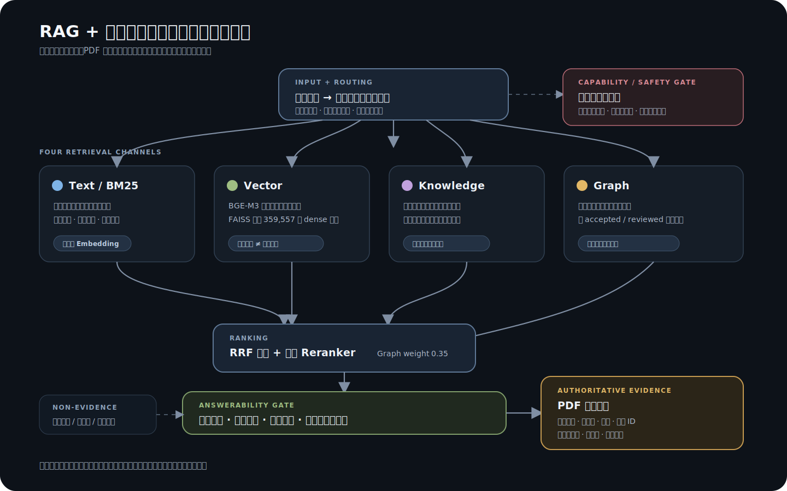

# RAG + 知识图谱模式

RAG + 知识图谱是 `nihaisha` 的可选增强模式。它适合在课程 PDF 中查原文、找页码、比较相关概念，并把答案和来源放在一起展示。

它不是默认模式，也不是“什么都能回答”的万能知识库。普通课程复习、逐课学习、截图检索和学习路线，通常仍由轻量模式处理得更直接。

## 它能带来什么

- 用白话提问时，帮助找到措辞不同但意思接近的课程段落。
- 查询方名、穴位、条文或出处时，优先保留准确原词。
- 通过知识关系找到相关课程线索，再回到原文核验。
- 在回答中直接展示原文摘录、文件名和页码，而不是只给一个文件位置。
- 没有足够证据时明确说明不足，不用模型记忆补写课程内容。

## 什么时候适合使用

| 你的需求 | 建议 |
| --- | --- |
| 查某句话、方名、穴位或古籍出处 | 很适合，可以重点核对原文与页码 |
| 用白话描述一个课程概念 | 适合，语义搜索可以补充关键词检索 |
| 比较两个方证或相关概念 | 适合，但结论必须有原文支持 |
| 查看某个实体和其他课程内容的关系 | 适合，图谱可以帮助导航 |
| 按课次复习、找截图、制定学习计划 | 优先使用轻量模式 |
| 查询当前资料库没有收录的课程 | 不适合，应明确提示资料缺失 |
| 根据个人病情开方、定剂量或指导针灸 | 不适合 |

## 它是怎样找到答案的

系统会从几个不同方向寻找材料：

1. **准确词语匹配**：适合查方名、穴位、原句和出处。
2. **语义搜索**：适合白话表达和课程原文措辞不同的情况。
3. **知识线索**：帮助发现方证、症状、比较关系等相关段落。
4. **图谱导航**：帮助找到有关联的实体和课程位置。

这些结果会被放在一起核对。只有真正包含问题关键内容、来源清楚并且能够回答当前问题的原文段落，才可以进入最终答案。

## 为什么同时需要关键词、Embedding、FAISS 和图谱

它们解决的问题不同，不能互相替代。

| 组成部分 | 对普通用户的意义 |
| --- | --- |
| 关键词检索 | 确保准确方名、穴位和原句不会被“意思相近”的内容取代 |
| Embedding | 理解白话表达与课程原文之间的语义相似性 |
| FAISS | 让系统能快速从大量语义资料中找到接近的段落 |
| 知识图谱 | 帮助发现实体之间的关系和相关课程线索 |
| PDF 原文 | 最终回答的依据 |

FAISS 只是加快语义资料的查找，不负责判断答案是否正确；图谱也只是导航，不是最终证据。即使某个结果“很相似”或“关系很近”，仍然必须回到 PDF 原文核验。

## 一个合格的回答应该包含什么

正常情况下，回答会包含：

- 直接回应问题的简要结论；
- 与结论对应的原文摘录；
- PDF 文件名和页码；
- 必要时提供上下文线索；
- 证据不足或资料缺失时的明确说明；
- 涉及医疗风险时的安全提醒。

只给文件名和页码、不展示支持内容，不算完整回答。只给图谱关系或语义相似结果，也不能作为课程结论。

## 它是否适用于任何问题

不能。以下情况仍可能得不到理想结果：

- 资料库里没有对应课程或原文；
- PDF 文字识别存在错字、断句或重复；
- 问题中的主语和目标不清楚；
- 冷门名称、异体字或简称还没有收录；
- 问题需要跨很多章节综合推理；
- 用户需要的是学习规划或个体化判断，而不是原文检索。

这个模式更重要的能力不是“每个问题都回答”，而是：有证据时展示证据，没有证据时如实说明，不用其他课程的相似内容拼成答案。

## 资料和使用成本

RAG 完整资源约 3.68 GB，属于可选下载内容。普通轻量模式不会自动下载这些资源；只有用户明确选择 RAG 并确认下载时才会准备本地数据。

语义搜索还需要可用的 Embedding 服务或本地模型。使用前应先完成环境和资源检查。如果语义搜索暂时不可用，准确词语检索和部分图谱导航仍可独立使用。

安装与资源准备入口见 [项目 README](../README.md)。

## 课程资料和关联资料如何区分

课程主资料、经典候选资料和外部关联参考资料会分开处理。外部参考资料默认不会混入课程结论；只有用户明确要求查看时才会单独展示，并标明“非倪海厦著作”。

课程中的讲解和古籍原文也应分别引用，不能把课程转述写成古籍原句。

## 医疗安全

本模式只用于课程学习、原文核对和资料研究，不提供个人诊断、处方、剂量决策、购药建议、针灸或外治操作指导。

胸痛、呼吸困难、意识改变、疑似中风、大出血等急重症信息，应优先联系当地急救或前往急诊，不能等待课程资料检索结果。

真实健康问题请通过正规医疗渠道面诊。更完整的边界见 [用途与风险说明](./USE_AND_RISK_NOTICE.md)。
